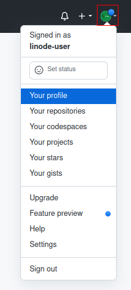

<div align="center">

# How to Create a GitHub Profile
<h3 align="center" id="author">
   Written by <a href="https://www.linkedin.com/in/profpan396/">Amar Pan, M.Ed.</a> 
   <div align="center">

 </h3>

<!--  -->
</div>

## Introduction
Creating a GitHub profile is a great way to show visitors what one is all about as a developer - what languages one knows, types of projects interested in, and general background informaton. In this guide, we'll cover how to create a repository that displays as a profile and how to add tools that display advanced coding statistics.  
<!-- Update to reflect the default categories GitHub prepopulates -->
| Before | After |
|:------:|:-----:|
| |  

## Create a Profile Repository
To make a GitHub profile, we must first create a repository with the same name as our GitHub username. 

|      Step      |      Instructions      |      Reference |
|----------------|------------------------|---------------
|1. Create a new repository | In the upper-right hand corner of the GitHub dashboard: <br>a. Click `+` <br> b. Click `New repository`            | 
|2. Add the details for the new repository | c. Under "Repository name", type in your GitHub username. <br><br> **For example, if my GitHub username is linuxfan123, I would type in `linuxfan123`** <br><br> d. Click the `Public` option so all users can see our newly created profile <br><br> e. Check the `Add a README file` box <br><br> f. Click the green `Create repository` button to make the new repository with all the above settings   | 
|3. View our new default profile | g. Click the white `View Profile` button on the right side of the page <br><br><br> h. Take a look at our new profile - by default, some placeholder text is inputted. <br><br> i. Click the pencil icon in the top-right hand corner of our new profile to initiate editing |   
| 4. Edit our new profile | j. Delete lines 3-6 and the ending `-->` <br><br> k. Add the missing information - think about what important information visitors looking at your code should know <br><br> l. Click the `Preview` tab to see what the new edits will actually look like <br><br> m. When satisfied, click the green `Commit changes` button to finalize the changes  |  
| 5. View your new profile | In the upper-right hand corner of the GitHub dashboard: <br><br>n. Click your profile picture <br><br> o. Click `Your profile` <br><br> | 

## Advancing Coding Statistic Add-ons
We can also choose to add from a variety of add-on tools that display insightful and interesting statistics about our coding history and habits.

**Note**: Take care to replace `<your-github-username>` with your own GitHub username when using the following code snippets and then delete the angle brackets `<>`.   

|   Add-on   |   Description   |   Preview   |   Code to Add 
|------------|-----------------|-----------------|----------
| Languages | Lists the most frequently coded in languages by percentage | [](https://github.com/anuraghazra/github-readme-stats) | ```[](https://github.com/anuraghazra/github-readme-stats)``` | 
| View Counter | test | test
| Streak Counter
