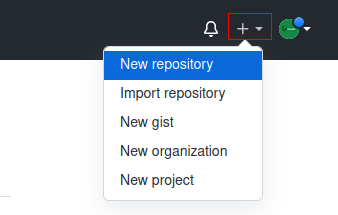

# How to Create a GitHub Profile
<h3 align="center" id="author">
   Written by <a href="https://www.linkedin.com/in/profpan396/">Amar Pan, M.Ed.</a> 
   

 </h3>

<!--  -->

## Introduction
Creating a GitHub profile is a great way to show visitors what one is all about as a developer - what languages one knows, types of projects interested in, and general background informaton. In this guide, we'll cover how to create a repository that displays as a profile and how to add tools that display advanced coding statistics.  

## Create a Profile Repository
To make a GitHub profile, we must first create a repository with the same name as our GitHub username. 

|      Step      |      Instructions      |      Reference
|----------------|------------------------|---------------
|1. Create a new repository | In the upper-right hand corner of the GitHub dashboard:  a. Click `+`   b. Click `New repository`            | 
|2. Add the details for the new repository | c. Under "Repository name", type in your GitHub username.    For example, if my GitHub username is linux123, I would type in `linuxfan123`    d. Click the `Public` option so all users can see our newly created profile    e. Check the `Add a README file` box    f. Click the green `Create repository` button to make the new repository with all the above settings   | 
|3. Edit our new profile | 

