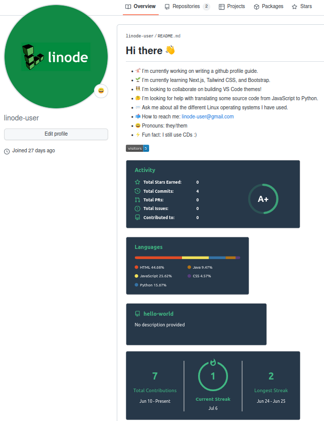
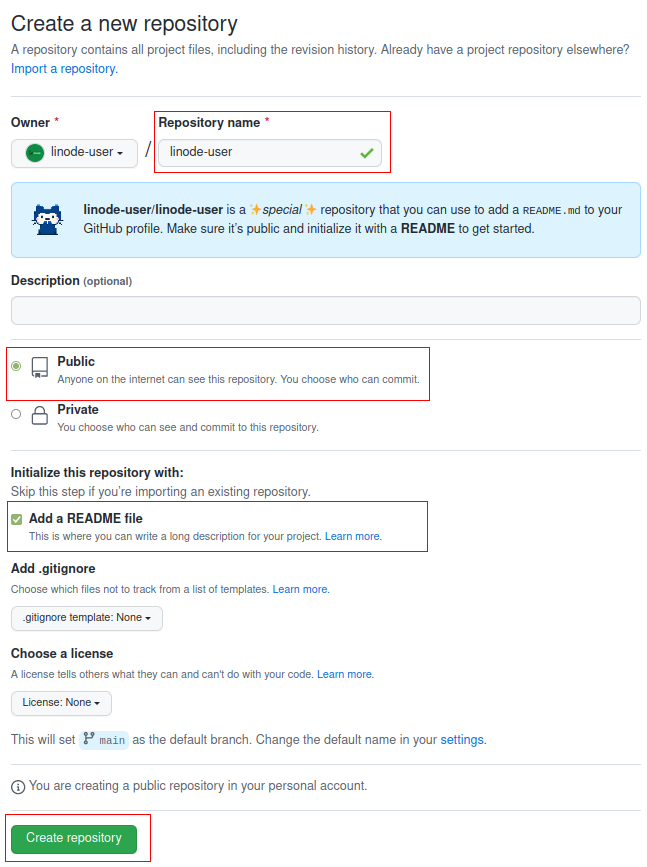
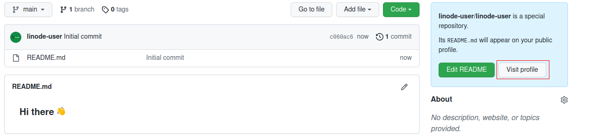
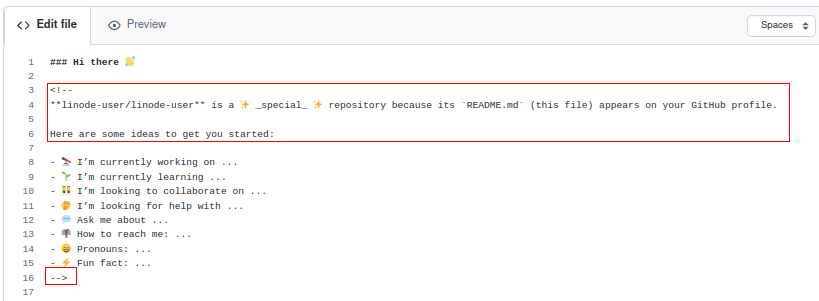
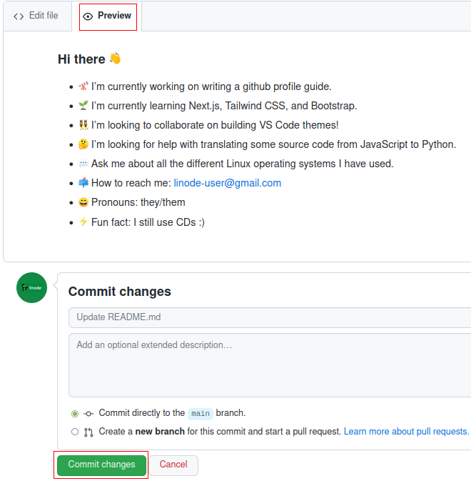

# How to Create a GitHub Profile
**Written by [Amar Pan, M.Ed.](https://www.linkedin.com/in/profpan396/)**   Technical Writer

<!-- Delete below for publication -->
 

  
   
  
   
  
  
  
   
  

  ### If you find this tutorial helpful, please consider giving it a :star:

 

 

 
Creating a GitHub profile is a great way to show visitors what you are all about as a developer - what languages and frameworks you know, types of work you are interested in, and general background information. 
  
In this guide, we'll cover how to create a repository that doubles as a profile and how to add advanced tools that display cool statistics about your coding history and habits. 

## Create a Profile Repository
To make a GitHub profile, you must first create a repository with the same name as your GitHub username. 

### 1. Create a new repository
In the upper-right hand corner of the GitHub dashboard: 
 
- a. Click `+`
- b. Click `New repository`
 

  
           
### 2. Add the details for the new repository
- a. Under "Repository name", type in your GitHub username  
**For example, if my GitHub username is linuxfan123, I would type in `linuxfan123`**
- b. Click the `Public` option so all users can see your newly created profile
- c. Check the `Add a README file` box
- d. Click the green `Create repository` button to make the new repository with all the above settings
 

### 3. View your new default profile
- a. Click the white `View Profile` button on the right side of the page
- b. Take a look at your new profile - by default, some placeholder text is inputted.
- c. Click the pencil icon in the top-right hand corner of your new profile to initiate editing
 

### 4. Edit your new profile
- a. Delete lines 3-6 and the ending `-->`
 

- b. Add the missing information - think about what important information visitors looking at your code should know
- c. Click the `Preview` tab to see what the new edits will look like
 

- d. When satisfied, click the green `Commit changes` button to finalize the changes

### 5. View your new profile
In the upper-right hand corner of the GitHub dashboard:
 
- a. Click your profile picture
- b. Click `Your Profile`

## Advanced Coding Statistic Add-ons
You can also choose to add from a variety of add-on tools that display insightful and interesting statistics about your coding history and habits. 
<!-- Convert note to Hugo-type for publication -->
**Note**: Take care to replace `<your-github-username>` with your own GitHub username when using the following code snippets and then delete the angle brackets `<>`. 
<!-- 
Take care to replace `<your-github-username>` with your own GitHub username when using the following code snippets and then delete the angle brackets `<>`. 
 -->

### Activity
Displays total stars, commits, pull requests, etc.
 

 

``

### Commits Graph
A simple graph displaying your daily commits over the last 30 days
 

 
`&bg_color=1c1917&color=ffffff&line=0891b2&point=ffffff&area_color=1c1917&area=true&hide_border=true&custom_title=GitHub%20Commits%20Graph" alt="GitHub Commits Graph" />`

### Top Languages
Lists your most frequently coded in languages by percentage
 

 
``

### Repository Highlight
Displays a single repository (just as it would look underneath your GitHub profile)
 

 
`<a href="https://github.com/<your-github-username>/<repository-name>">&repo=<repo-name>&theme=vue-dark" /></a>`

### Streak Counter
Lists your current and longest streak of making at least one daily GitHub commit
 

 
``

### Visitor Counter
A running counter of how many times your GitHub profile has been visited
 

 
``

## More Information

You may wish to consult the following resources for additional information on this topic. While these are provided in the hope that they will be useful, please note that we cannot vouch for the accuracy or timeliness of externally hosted materials.

- [Official Vim Documentation](https://www.vim.org/docs.php)

### ***If you found this tutorial helpful, please consider giving it a :star:
   
Copyright :copyright: 2021-2022   Pan You Can

[How to Write a Coding Bootcamp README](https://github.com/profpan396/how-to-write-a-README)

[How to Change Z Shell Themes](https://github.com/profpan396/how-to-install-and-configure-zshell)

[How to Use the Command Line Vim Editor](https://github.com/profpan396/how-to-use-the-vim-text-editor/)

